<p align="center">
  <picture>
    <source media="(prefers-color-scheme: dark)" srcset="assets/header-dark.png">
    
  </picture>
</p>

<p align="center">
  <a href="https://onebrain.run"></a>
  <a href="https://x.com/onebrain_run"></a>
  <a href="https://github.com/onebrain-ai/onebrain/stargazers"></a>
</p>
<p align="center">
  <a href="https://www.npmjs.com/package/@onebrain-ai/cli"></a>
  <a href="PLUGIN-CHANGELOG.md"></a>
  <a href="LICENSE"></a>
</p>

<p align="center">
  <em>Your AI forgets everything when the session ends.<br>
  Your notes, your AI, and your tools live in separate silos.<br>
  OneBrain fixes both — giving you a thinking partner that remembers everything.</em>
</p>

<p align="center">
  <strong>Your personal AI OS</strong> — persistent memory, 25+ skills, and a full local stack<br>
  (Claude Code + Obsidian + tmux + Telegram), entirely on your own machine.
</p>

<p align="center">
  <a href="#installation">Get Started →</a> &nbsp;·&nbsp; <a href="#commands">View Commands →</a>
</p>

---

## What is OneBrain?

OneBrain is an AI operating system layer built on top of Obsidian. It gives your AI agent persistent memory, a structured knowledge vault, and 25+ pre-built skills — so every session picks up exactly where the last one left off.

Unlike chat-based AI tools, OneBrain lives in plain Markdown files you own forever. No cloud sync required. No proprietary format. Just your agent, your vault, your data.

> Most tools ask you to query an AI. OneBrain **co-evolves** with you — every preference you teach sharpens the agent, every link it surfaces sharpens you.

**The bidirectional flow:**

- **Human → Agent** — Every preference, decision, and correction becomes persistent memory. The agent calibrates to you with every interaction.
- **Agent → Human** — Captures, classifies, links, and synthesizes the noise of your day — so your attention stays on what only you can do.

<p align="center">
  <picture>
    <source media="(prefers-color-scheme: dark)" srcset="assets/diagrams/bidir-flow-dark.svg">
    
  </picture>
</p>

**Harness-agnostic** — Claude Code · Gemini CLI · OpenAI Codex · Qwen · or BYO LLM via API key. [See the architecture ↓](#the-harness-os-architecture)

---

## The Harness OS Architecture

OneBrain doesn't compete with Claude Code, Gemini CLI, or any other AI harness — **it extends them**. Whichever harness you drive, OneBrain adds the persistent memory, skill surface, and personal calibration that harnesses don't ship with. Same harness; suddenly it remembers who you are, what you're working on, and how you like to work — all while your Obsidian vault stays the durable source of truth underneath.

<p align="center">
  <picture>
    <source media="(prefers-color-scheme: dark)" srcset="assets/diagrams/harness-os-stack-dark.svg">
    
  </picture>
</p>

| # | Layer | Role | What lives here |
|---|---|---|---|
| 01 | **OneBrain** | OS layer (plugin + CLI) | 25+ skills · lifecycle hooks · vault sync · indexing · checkpoints · harness routing |
| 02 | **Harness** | Agentic runtime | Bring your own — Claude Code · Gemini CLI · Codex · Qwen · ... |
| 03 | **LLM** | Intelligence source | Local (mlx, ollama) · cloud (claude, gemini, gpt) · raw API |
| 04 | **Obsidian Vault** | Source of truth | Plain Markdown — notes, memory, decisions, knowledge graph |

The **Harness** layer is where most AI tools pick a fight with each other. We don't — pick whichever harness you love. By familiarity, by task, or by cost. Your vault stays the same.

### Extend, don't replace

A great harness already knows how to talk to an LLM, edit files, and run shell commands. It does **not** know who you are, what you've decided last week, or how you prefer to work. OneBrain fills exactly that gap.

| | What OneBrain adds | Why it matters |
|---|---|---|
| 🧠 | **Memory** — Identity, preferences, decisions, project state — promoted across four tiers as it earns trust | The harness alone starts every session from zero. OneBrain doesn't. |
| ⚡ | **Skills** — 25+ vault-aware verbs (`/braindump`, `/research`, `/distill`, `/learn`, `/wrapup`, …) | Pre-built workflows the harness would otherwise need you to script every time. |
| 🎯 | **Calibration** — Every correction, every preference, every learned habit tunes the agent to *you* | The longer you use it, the sharper it gets — your vault is the training data. |
| 🔀 | **Continuity** — Context lives in the vault, not the harness | Switch from Claude Code to Gemini CLI to Codex. Same memory. Same skills. Same agent. |

> Pick a harness for **how it lets you work** (CLI, IDE, mobile, API). Pick OneBrain for **how it remembers you** across all of them.

---

## One Vault, All Projects — The Command Center

Obsidian becomes your dispatch hub for everything you do:

- **Read once, understand all** — agent context lives in one place, never re-explained.
- **Code in repos, orchestration in vault** — agent dispatches from here to wherever the work actually lives.
- **Markdown replaces Slack / Linear / Notion** — version-controlled, AI-readable, yours forever.

<p align="center">
  <picture>
    <source media="(prefers-color-scheme: dark)" srcset="assets/diagrams/vault-hub-dark.svg">
    
  </picture>
</p>

The agent reaches outward FROM the vault to every surface where the work actually lives. No tab juggling. No tool sprawl.

---

## Every Session Sharpens Both

OneBrain runs as a tight 3-step loop. Each cycle, both sides sharpen.

<p align="center">
  <picture>
    <source media="(prefers-color-scheme: dark)" srcset="assets/diagrams/coevo-loop-dark.svg">
    
  </picture>
</p>

1. **Capture** — Talk to the agent in natural language. It writes, classifies, and links your thoughts in real time. → `/braindump` · `/capture` · `/bookmark`
2. **Evolve** — `/research` and `/distill` expand your knowledge. `/learn` deepens the agent. The loop tightens. → `/research` · `/distill` · `/learn`
3. **Wrapup** — `/wrapup` consolidates the session log. `/recap` promotes lessons to memory. → `/wrapup` · `/recap`

### Behind the loop

After `/onboarding`, your AI agent:

1. **Loads your identity** — name, role, goals, communication style, active projects
2. **Greets you with context** — inbox status, overdue tasks, patterns from recent sessions
3. **Remembers everything** — decisions, preferences, and insights accumulate over time
4. **Suggests next actions** — based on what's in your vault, not what it can infer from scratch

---

## Memory System

OneBrain uses a four-tier memory system — knowledge sinks downward as it gets validated, while the agent recalls upward on demand. The Semantic tier has two loading modes (always-loaded and lazy-loaded).

<p align="center">
  <picture>
    <source media="(prefers-color-scheme: dark)" srcset="assets/diagrams/memory-tiers-dark.svg">
    
  </picture>
</p>

| Tier | Location | What it stores | Promoted by |
|------|----------|---------------|-------------|
| **Working** | `00-inbox/` + current session | Raw captures, active conversation | `/consolidate`, `/wrapup` |
| **Episodic** | `07-logs/YYYY/MM/` | Session summaries, decisions, action items | `/wrapup`, auto-checkpoint |
| **Semantic** (always-loaded) | `05-agent/MEMORY.md` + `05-agent/MEMORY-INDEX.md` | Identity + Active Projects + Critical Behaviors + memory file registry | `/learn`, `/onboarding` |
| **Semantic** (lazy-loaded) | `05-agent/memory/` | Behavioral patterns, domain facts — loaded on demand via MEMORY-INDEX.md | `/learn`, `/recap`, `/memory-review` |
| **Knowledge** | `03-knowledge/` | Permanent synthesized notes | `/distill` |

### Memory Promotion

Each tier has specific skills responsible for writing to it. Knowledge moves down the stack only as fast as it earns trust.

| Layer | Storage | Written by |
|---|---|---|
| Session log | `07-logs/` | `/wrapup` (end of session) |
| Memory files | `05-agent/memory/` | `/learn` (user-driven, single fact), `/recap` (batch synthesis), `/memory-review` (edits) |
| Always-loaded — Identity | `05-agent/MEMORY.md` | `/onboarding` (one-time), manual edits |
| Always-loaded — Active Projects | `05-agent/MEMORY.md` | `/learn` (project lifecycle events), manual edits |
| Always-loaded — Critical Behaviors | `05-agent/MEMORY.md` | `/learn` only (user explicitly teaches behavior; must meet all 3 threshold conditions) |
| Always-loaded — Memory registry | `05-agent/MEMORY-INDEX.md` | Any skill writing to `memory/` (`/learn`, `/recap`, `/memory-review`) |

**Promotion pipeline:**
session → session log (`/wrapup`) → `memory/` files (`/recap`) → `MEMORY.md` Critical Behaviors (`/learn`)

**Rules:**
- `/wrapup` writes session logs only — does not promote to `memory/`
- `/learn` writes to `memory/` immediately; only skill that writes to MEMORY.md Critical Behaviors
- `/recap` batch-promotes from session logs → `memory/` only — does NOT write to MEMORY.md
- Only behaviors applying every session with high-impact failure if missed → MEMORY.md Critical Behaviors
- `MEMORY-INDEX.md` is loaded every session alongside `MEMORY.md` — it is the registry that enables lazy-loading of `memory/` files; updated automatically by any skill that writes to `memory/`

### Automatic Session Saving

OneBrain has automatic behaviors that run without you doing anything:

| Behavior | Trigger | What it does |
|----------|---------|-------------|
| **Auto Checkpoint** | Every 15 messages, every 30 min, or before context compression | Writes a checkpoint file to `07-logs/YYYY/MM/` as a safety net |
| **Auto Session Summary** | You say "bye", "good night", "I'm done for today", etc. — only if `/wrapup` was not already run this session AND ≥ 3 exchanges | Saves a silent session log (marked `auto-saved: true`) without showing any output |

**How they work together:**

- Say "bye" → Auto Session Summary fires silently and saves a session log. No extra steps needed.
- If you already ran `/wrapup` manually and then say "bye": Auto Session Summary **skips** — the log was already written.
- If the session ends with no signal (browser closed, terminal killed): Auto Checkpoint files serve as the recovery mechanism. At next session start, Phase 2 automatically synthesizes any orphaned checkpoints into a session log.

**`/wrapup` is manual only.** Run it yourself when you want a visible, full session summary with output shown.

**The practical result:** Just say "bye" and everything is saved. If the session ends unexpectedly, you lose at most 15 messages — the last checkpoint recovers the rest.

> Auto Checkpoint runs on Claude Code (`Stop` hook) and Gemini CLI (`AfterAgent` hook), and uses the `onebrain` CLI binary. Install with `npm install -g @onebrain-ai/cli`. Auto Session Summary works with any agent that follows INSTRUCTIONS.md.

---

## Built for Synergetic Thinking

OneBrain doesn't just store markdown. Every feature exists to make you and the agent better at each other's job.

| | Feature | Description |
|---|---|---|
| 🧠 | **Persistent Memory** | Remembers your name, goals, preferences, and decisions across every session |
| 🖥️ | **Personal AI OS** | Full local stack: Claude Code + Obsidian + tmux + Telegram — no cloud infra needed |
| ⚡ | **25+ Skills** | Braindump, research, consolidate, bookmark, import files, daily briefing, and more |
| 📂 | **Vault-native Markdown** | Plain Markdown, no lock-in. Your data stays yours forever |
| 🔀 | **Multi-Harness OS** | Switch between Claude Code, Gemini CLI, Codex, Qwen, or BYO LLM — context never breaks. [See architecture ↑](#the-harness-os-architecture) |
| 🔌 | **Zero Config** | Clone, open in Obsidian, run `/onboarding`. Ready in under 2 minutes |
| 📓 | **Session Logs & Checkpoints** | Every conversation saved with summaries and action items. Auto-checkpoints fire every 15 messages or 30 min so nothing is lost mid-session *(supported on Claude Code and Gemini CLI)* |
| 💾 | **Auto Session Summary** | When you say "bye", the agent silently saves a complete session log — no `/wrapup` needed |
| 🔗 | **Knowledge Synthesis** | `/consolidate` turns inbox captures into permanent connected knowledge |
| 🔬 | **Confidence-scored Memory** | Every insight carries `[conf:high/medium/low]` + `[verified:YYYY-MM-DD]` — knowledge that grows more reliable with use |
| 💎 | **Knowledge Distillation** | `/distill` crystallizes a completed research thread into a permanent structured note in your knowledge base |
| 🩺 | **Vault Doctor** | `/doctor` audits broken links, orphan notes, stale memory, and inbox backlog; `--fix` auto-repairs confidence scores and wikilinks |
| 🎓 | **Teachable AI** | `/learn` permanently shapes how your agent thinks and responds |
| 🪄 | **Smart Memory Review** | `/memory-review` lets you interactively prune, update, or archive memory entries one by one |
| 🔒 | **Concurrent-session Safe** | Each session generates an isolated 6-char token — multiple parallel sessions never mix checkpoints |
| 📱 | **Mobile Access** | Send instructions and receive briefings from anywhere via Telegram |
| ⚙️ | **CLI Binary** | `onebrain` binary handles checkpoints, session init, doctor, vault-sync, and updates — no Bun, Python, or Node.js required |

---

## Use Cases

### 🖥️ Personal AI OS

Run OneBrain as your personal AI operating system — a complete AI environment that runs locally with no cloud infrastructure required.

**Recommended stack:**

| Tool | Role |
|------|------|
| [Claude Code](https://claude.ai/code) | Your AI agent, running in the terminal |
| [Obsidian](https://obsidian.md) | Your vault — single source of truth for memory and knowledge |
| [tmux](https://github.com/tmux/tmux) | Persistent sessions that survive disconnects and reboots |
| [Telegram](https://telegram.org) | Mobile access: send instructions, receive briefings from anywhere |

**Setting up the full stack:**

1. Install OneBrain and open your vault in Obsidian ([Get Started](#installation))
2. Start a tmux session: `tmux new -s onebrain`
3. Start Claude Code in your vault directory: `claude`
4. Run `/telegram:configure` to connect Claude Code's built-in Telegram channel — no custom bot or external infra needed
5. From any device, open Telegram and send instructions directly to your OneBrain agent

Your agent, your vault, your data — forever.

### 🧠 Thinking Partner

Use OneBrain as a daily thinking partner. Capture ideas with `/braindump`, research topics with `/research`, synthesize knowledge with `/consolidate`, and surface connections you'd never find manually with `/connect`.

### 📚 Knowledge Base Builder

Turn your AI into a knowledge curator: research, summarize, import files, and build a connected Markdown knowledge base that grows smarter over time.

---

## Installation

### Pick Your Harness

Each harness reads OneBrain's instruction file automatically. Install it, run it inside your vault, and the plugin loads on first prompt.

| Harness | Install | Run | Reads |
|---|---|---|---|
| **Claude Code** *(recommended)* | `npm install -g @anthropic-ai/claude-code` | `claude` | `CLAUDE.md` |
| **Gemini CLI** | `npm install -g @google/gemini-cli` | `gemini` | `GEMINI.md` |
| **OpenAI Codex** | `npm install -g @openai/codex` | `codex` | `AGENTS.md` |
| **Qwen Code** | `npm install -g @qwen-code/qwen-code` | `qwen` | `AGENTS.md` |

> Auto-checkpoint and stop-hook coverage ship for Claude Code (`Stop` + optional `PostToolUse` qmd) and Gemini CLI (`AfterAgent` + optional `AfterTool` qmd) out of the box. Slash commands are namespaced on Gemini (`/onebrain:braindump`) to avoid collisions with built-ins; on Claude they invoke directly (`/braindump`). Other harnesses gain hook coverage as upstream support lands.

### 1. Install the OneBrain CLI

```bash
npm install -g @onebrain-ai/cli
# or: bun install -g @onebrain-ai/cli
```

The installer automatically downloads the correct compiled binary for your platform — no Bun installation required.

### 2. Create and initialize your vault

```bash
mkdir my-vault && cd my-vault
onebrain init
```

### 3. Open Obsidian

File → Open Folder as Vault → select this folder

### 4. Personalize your vault

In your harness: `/onboarding`

> **Adding OneBrain to an existing vault?** `cd` into it and run `onebrain init`

### Bring Your Own LLM (via Claude Code)

Already love Claude Code? Use it as a universal frontend. Point `ANTHROPIC_BASE_URL` at any OpenAI-compatible endpoint — Claude Code stays the harness, the LLM behind it changes per task.

```bash
# Recommended: claude-code-router handles Anthropic ↔ provider translation
npm install -g @musistudio/claude-code-router
ccr code                                    # first-run config, then launches Claude Code via the router
# (later) ccr stop                          # tear down the router before going native again

# Or direct: point ANTHROPIC_BASE_URL at any Anthropic-protocol endpoint
export ANTHROPIC_BASE_URL=https://your-router-or-anthropic-compatible-host
export ANTHROPIC_API_KEY=sk-byok-key
cd vault && claude

# Switch back to native Claude any time (manual-export route)
unset ANTHROPIC_BASE_URL ANTHROPIC_API_KEY
claude
```

| Route | What it gets you |
|---|---|
| **Local** (mlx, ollama, llama.cpp) | Cost-free routine work, full privacy. Pair with [`litellm`](https://github.com/BerriAI/litellm) or [`claude-code-router`](https://github.com/musistudio/claude-code-router). |
| **Cloud BYOK** (Claude, Gemini, GPT, Groq, OpenRouter) | Pay-as-you-go premium reasoning. One env-var swap, no code changes. |
| **Hybrid** (route by task or by cost) | Cheap models for routine, premium when it counts. |

Same vault. Same skills. Same memory. The LLM swaps; OneBrain doesn't notice.

---

> **After `/update`:** Run `/reload-plugins` to pick up changes in your current session, or simply start a new session.

---

<a id="commands"></a>

## 📋 25+ Commands

Skills are organized by workflow phase. **Gemini CLI users:** prepend the `onebrain:` namespace, e.g. `/onebrain:braindump` instead of `/braindump` (avoids collisions with Gemini built-in commands like `/help` and `/tasks`).

### 📥 INPUT — Capture & ingest

| Command | What it does |
|---------|-------------|
| `/onboarding` | First-run setup — run this first · *first run only* |
| `/braindump` | Dump everything on your mind — it gets classified and filed |
| `/capture` | Quick note with auto-linking to related notes |
| `/bookmark [url]` | Save a URL with AI-generated name, description, and category to Bookmarks.md |
| `/summarize [url]` | Fetch a URL and save a deep summary note |
| `/import [path]` | Import local files (PDF, Word, images, scripts) into vault notes |
| `/reading-notes` | Turn a book or article into structured notes |
| `/research [topic]` | Web research → structured note in your vault |

### ⚙️ PROCESS — Synthesize & organize

| Command | What it does |
|---------|-------------|
| `/consolidate` | Process inbox into permanent knowledge |
| `/distill [topic]` | Crystallize a completed topic thread into a permanent knowledge note in `03-knowledge/` |
| `/connect` | Find connections between notes, suggest wikilinks |
| `/recap` | Cross-session synthesis — batch-promote recurring insights from session logs into `memory/` files (does NOT write to MEMORY.md) |
| `/weekly` | Review the week, surface patterns, set intentions |
| `/daily` | Daily briefing — surfaces tasks and last session context, then saves your focus as a daily note |
| `/learn` | Teach the agent something — facts about your world or behavioral preferences |

### 🔍 RECALL — Retrieve & navigate

| Command | What it does |
|---------|-------------|
| `/search` | General vault retrieval — answers what + why questions across MEMORY, sessions, plans, decisions logs, notes |
| `/tasks` | Live task dashboard in Obsidian — creates/updates `TASKS.md` with always-current query sections |
| `/moc` | Vault portal in Obsidian — creates/updates `MOC.md` with projects, areas, knowledge, tasks, and pinned links |
| `/memory-review` | Interactive review of memory files — keep, update, deprecate, or delete entries |

### 🔧 MAINTAIN — System housekeeping

| Command | What it does |
|---------|-------------|
| `/update` | Update skills, config, and plugins from GitHub |
| `/doctor` | Vault + config health check — broken links, orphan notes, stale memory entries, inbox backlog |
| `/reorganize` | Migrate flat notes into organized subfolders |
| `/clone` | Package your agent context for transfer to a new vault |
| `/qmd` | Set up fast vault search index — enables semantic search across all notes |
| `/help` | List all available commands with descriptions |
| `/wrapup` | Wrap up session — merges any auto-checkpoints and saves full summary to session log |

<details>
<summary><strong>📁 Vault Structure</strong></summary>
<br>

Vault folders are created during `/onboarding`.

```
onebrain/
├── 00-inbox/          Raw braindumps and captures (process regularly)
│   └── imports/       Staging area for /import (drop files here)
├── 01-projects/       Active projects with inline tasks
├── 02-areas/          Ongoing responsibilities (health, finances, career...)
├── 03-knowledge/      Your own synthesized thinking and insights
├── 04-resources/      External info — research output, summaries, reference
├── 05-agent/          AI-specific context and memory
│   ├── MEMORY.md      Identity + Active Projects + Critical Behaviors
│   ├── MEMORY-INDEX.md  Registry of all memory files — loaded every session, enables lazy-loading
│   └── memory/        All memory files — behavioral patterns, domain context, project facts
├── 06-archive/        Completed projects and archived areas
├── 07-logs/           Session logs and checkpoints (YYYY/MM/ subfolders)
├── attachments/       Copied files from /import --attach
│   ├── pdf/
│   ├── images/
│   └── video/
├── TASKS.md           Live task dashboard (created by /tasks, opened in Obsidian)
├── MOC.md             Vault portal — Map of Content (created by /moc)
├── CLAUDE.md          Instructions for Claude Code
├── GEMINI.md          Instructions for Gemini CLI
├── AGENTS.md          Universal agent instructions
├── vault.yml          Your vault configuration (created during onboarding)
├── .claude/plugins/   AI skills, hooks, and shared INSTRUCTIONS (read by Claude Code)
└── .gemini/           Gemini CLI project config — hooks + namespaced slash commands
```

The core workflow: capture everything to inbox → process with `/consolidate` → synthesize into knowledge or save as reference → archive what's done.

**`00-inbox/`** — Raw braindumps and captures
Process regularly. Everything unclassified lands here first. The `imports/` subfolder is the staging area for `/import` — copy files there and run `/import` to distill them into vault notes.

**`01-projects/`** — Active work with a clear goal and end date
Examples: `work/Website Redesign.md`, `personal/Japan Trip 2026.md`

**`02-areas/`** — Ongoing responsibilities that never "complete"
Examples: `health/Running Log.md`, `finances/Budget 2026.md`

**`03-knowledge/`** — Your own synthesized thinking
Conclusions, frameworks, and insights you've developed — not raw reference material.
Examples: `productivity/Deep Work Principles.md`, `technology/When to Use Microservices.md`

**`04-resources/`** — External information saved for reference
Output from `/research`, `/summarize`, `/reading-notes`, `/import`, and saved reference material.
Examples: `research/Zettelkasten Method.md`, `code-snippets/Go HTTP Middleware.md`

**`05-agent/`** — Your agent's portable mind
Everything the AI knows about you. Copy this folder to move your agent to a new vault.
- `MEMORY.md` — Identity + Active Projects + Critical Behaviors — loaded every session
- `MEMORY-INDEX.md` — Registry of all memory files — loaded every session, enables lazy-loading of `memory/` files
- `memory/` — All memory files — behavioral patterns, domain context, project facts

**`06-archive/`** — Completed projects and retired areas
Organized by date archived: `06-archive/YYYY/MM/`.

**`07-logs/`** — Session logs and checkpoints
Session logs: `07-logs/YYYY/MM/YYYY-MM-DD-session-NN.md` — generated by `/wrapup` or auto-saved at session end.
Checkpoints: `07-logs/YYYY/MM/YYYY-MM-DD-{session_token}-checkpoint-NN.md` — auto-generated by hooks every 15 messages or 30 minutes, and before context compression. Incorporated and deleted by `/wrapup` when wrapping up.

</details>

## Task Syntax

OneBrain creates tasks in [Obsidian Tasks](https://publish.obsidian.md/tasks/) plugin format:

```
- [ ] Task description 📅 2026-03-25
- [ ] High priority task 🔺 📅 2026-03-22
```

Tasks live inline in your notes — the Tasks plugin surfaces them across the vault. Run `/tasks` to open a live dashboard in Obsidian (`TASKS.md` at vault root) with sections for overdue, due this week, unscheduled, due later, and recently completed.

---

## OneBrain Cloud

Multi-device sync and hosted agent runtimes. Your unified intelligence travels with you.

| Tier | What you get | Status |
|---|---|---|
| **FREE** | Local vault · OSS skills · BYOK | ✅ Available now |
| **PRO** | Sync · mobile · hosted runtime | 🟡 [Join waitlist](https://onebrain.run) |
| **TEAM** | Shared intelligence · team mesh | 🟡 Coming soon |

---

<details>
<summary><strong>⚙️ Prerequisites & Detailed Setup</strong></summary>
<br>

### Prerequisites

**Required:** [git](https://git-scm.com) — used to version-control your vault.

| Platform | Install command |
|----------|----------------|
| macOS (Homebrew) | `brew install git` |
| macOS (Xcode CLT) | `xcode-select --install` |
| Windows (winget) | `winget install --id Git.Git` |
| Windows (Chocolatey) | `choco install git` |
| Debian / Ubuntu | `sudo apt install git` |
| Fedora / RHEL | `sudo dnf install git` |
| Arch | `sudo pacman -S git` |

Verify with `git --version` before running the installer.

**Optional:** [bun](https://bun.sh) — not required for most users. `npm install -g @onebrain-ai/cli` automatically downloads a compiled binary for your platform. Bun is only needed if you're on an unsupported platform or want to install from source.

**Windows:** Git for Windows (above) includes Git Bash, which provides the `bash` environment required to run all hooks.

### Community Plugins

These three plugins are pre-configured in vault settings — install them via **Settings → Community plugins → Browse**, then click **Trust author and enable plugins** when prompted:

- **Tasks** — task management with due dates
- **Dataview** — query notes like a database
- **Terminal** — run your AI agent from within Obsidian

These are recommended but optional:

- **Templater** — advanced templates
- **Calendar** — visual calendar view
- **Tag Wrangler** — manage tags across vault
- **QuickAdd** — fast capture workflows
- **Obsidian Git** — version control for your vault

### Claude Code Skills (Optional)

For Obsidian-specific Claude Code skills (markdown, bases, canvas, and more), install the [Obsidian Skills](https://github.com/kepano/obsidian-skills) plugin separately:

```
/plugin marketplace add kepano/obsidian-skills
/plugin install obsidian@obsidian-skills
```

</details>

---

## Customization

Edit `05-agent/MEMORY.md` directly to update your identity, goals, or recurring context at any time. The AI picks up changes on the next session start.

The full set of AI instructions that govern your agent's behavior lives in [`.claude/plugins/onebrain/INSTRUCTIONS.md`](.claude/plugins/onebrain/INSTRUCTIONS.md). You can read it to understand how your agent works. Note that `/update` will overwrite this file — add any session-level customizations to your `CLAUDE.md` instead, so they survive updates.

## Contributing

Pull requests welcome. See [CONTRIBUTING.md](CONTRIBUTING.md) for guidelines.

## License

[MIT](LICENSE)
