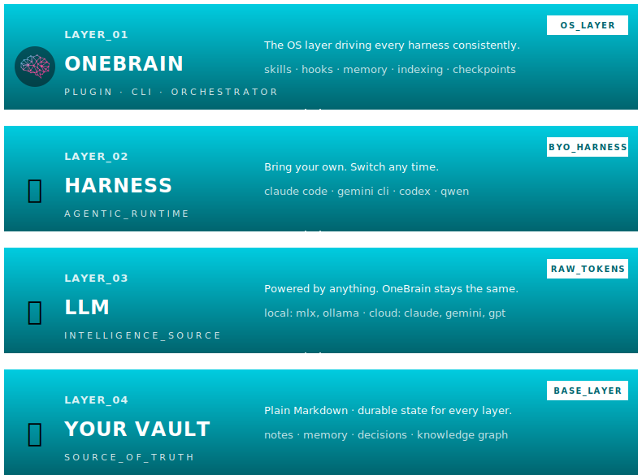
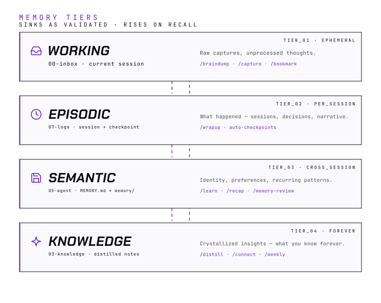
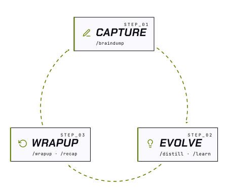

<p align="center">
  <picture>
    <source media="(prefers-color-scheme: dark)" srcset="assets/header-dark.svg">
    
  </picture>
</p>

<p align="center">
  <a href="https://onebrain.run"></a>
  <a href="https://x.com/onebrain_run"></a>
  <a href="https://github.com/onebrain-ai/onebrain/stargazers"></a>
</p>
<p align="center">
  <a href="https://github.com/onebrain-ai/onebrain-cli/releases/latest"></a>
  <a href="CHANGELOG.md"></a>
  <a href="LICENSE-MIT"></a>
</p>

<p align="center">
  <strong>OneBrain</strong> is a free, open-source AI OS layer: persistent memory, 30 skills, and a portable vault that works with any AI harness — entirely on your machine.
</p>

<p align="center">
  <a href="#quickstart">Get Started →</a> &nbsp;·&nbsp; <a href="#commands">View Commands →</a>
</p>

---

## What is OneBrain?

**Imagine every AI harness as a car you can drive.** Claude Code, Gemini CLI, Codex — each is a complete car from a different maker, with its own engine (the LLM) under the hood and its own dashboard. Any of them will get you where you're going.

**But switch cars and you start over.** New controls to learn, and everything you'd dialed in — your preferences, your history, the way it had learned to work for you — stays behind in the car you left.

**OneBrain isn't a car, and it isn't an engine.** It's the free, open-source ([MIT](LICENSE-MIT)/[Apache-2.0](LICENSE-APACHE)) layer that rides with *you* — making every car feel like yours, so you drive whichever you like, change cars any time, and never relearn a thing:

- **The plug-in ECU** — the brain. Drop it into any car and you get the same skills, the same workflows, the same behavior — as close to identical as each car allows. It decides *what* to do and gets the most out of whatever engine it's given.
- **The toolkit** ([`onebrain-cli`](https://github.com/onebrain-ai/onebrain-cli)) — the native tools that do the real work: indexing, search, scheduling, task queries — all running the same on every car, instead of improvising with whatever each one has built in. OneBrain runs without it, but it's the upgrade that makes the whole thing perform.
- **The driver profile** — your memory, preferences, decisions, and knowledge ride with you, not with the car. Change cars any time — it all comes along.

*Drive whichever car you like. Your brain — and its toolkit — ride with you.*

<p align="center">
  <picture>
    <source media="(prefers-color-scheme: dark)" srcset="assets/diagrams/car-analogy-dark.svg">
    
  </picture>
</p>

| Behind the wheel | In the AI stack |
|---|---|
| The brands you can drive — Toyota, BMW, Tesla | AI companies — Anthropic, Google, OpenAI |
| Engine under the hood | LLM — Claude, Gemini, GPT, local models |
| The car you drive | Harness — Claude Code, Gemini CLI, Codex, Qwen |
| Plug-in ECU — the brain | **OneBrain plugin** — skills, hooks, memory system, calibration |
| The toolkit | **`onebrain-cli`** — the add-on kit of native operations that run the same on every harness |
| The driver profile that rides with you | **Your vault** — plain Markdown you own forever |

> Pick a harness for **how it lets you work** (CLI, IDE, mobile, API). Pick OneBrain for **how it remembers you** across all of them.

---

## Quickstart

```bash
# 1. Install the CLI
brew install onebrain-ai/onebrain/onebrain
# or: npm install -g @onebrain-ai/cli

# 2. Create your vault
mkdir my-vault && cd my-vault
onebrain init

# 3. Start working — pick one
onebrain serve --open   # browser, no harness needed
claude                  # or any supported harness

# 4. Personalize (inside your harness, or the web UI chat)
/onboarding
```

---

## How it works

### The stack

OneBrain doesn't compete with Claude Code, Gemini CLI, or any other AI harness — **it extends them**. Whichever harness you drive, OneBrain adds the persistent memory, skill surface, and personal calibration that harnesses don't ship with. Same harness; suddenly it remembers who you are, what you're working on, and how you like to work — all while your Markdown vault stays the durable source of truth underneath.

<p align="center">
  <picture>
    <source media="(prefers-color-scheme: dark)" srcset="assets/diagrams/harness-os-stack-dark.svg">
    
  </picture>
</p>

| # | Layer | Role | What lives here |
|---|---|---|---|
| 01 | **OneBrain** | OS layer (plugin + CLI) | 30 skills · lifecycle hooks · local vault sync · indexing · checkpoints · harness routing |
| 02 | **Harness** | Agentic runtime | Bring your own — Claude Code · Gemini CLI · Codex · Qwen · ... |
| 03 | **LLM** | Intelligence source | Local (mlx, ollama) · cloud (claude, gemini, gpt) · raw API |
| 04 | **Markdown Vault** | Source of truth | Plain Markdown — notes, memory, decisions, knowledge graph |

**Extend, don't replace.** A great harness already knows how to talk to an LLM, edit files, and run shell commands. It does not know who you are, what you've decided last week, or how you prefer to work. OneBrain fills exactly that gap:

| | What OneBrain adds | Why it matters |
|---|---|---|
| 🧠 | **Memory** — Identity, preferences, decisions, project state — promoted across four tiers as it earns trust | The harness alone starts every session from zero. OneBrain doesn't. |
| ⚡ | **Skills** — 30 vault-aware verbs (`/braindump`, `/research`, `/distill`, `/learn`, `/wrapup`, …) | Pre-built workflows the harness would otherwise need you to script every time. |
| 🎯 | **Calibration** — Every correction, every preference, every learned habit tunes the agent to *you* | The longer you use it, the sharper it gets — your vault is the training data. |
| 🔀 | **Continuity** — Context lives in the vault, not the harness | Switch from Claude Code to Gemini CLI to Codex — context carries over. |

### The plugin decides, the CLI acts

OneBrain ships as two halves of one system. The **plugin** is the brain — the skills, hooks, and memory that decide *what* should happen. **`onebrain-cli`** is the toolkit — a native Rust binary that carries the work out precisely, the same way on every harness.

The plugin runs on its own. Without the CLI it leans on the harness's LLM to improvise the mechanics — grep the vault, count due tasks, resolve the session token, reindex search. But every harness improvises differently: each is limited to the tools its vendor designed and the way its model was trained. The CLI removes that lottery — the same command, the same result, in any car.

| Job | Plugin alone — borrowed tools | With `onebrain-cli` — its own toolkit |
|---|---|---|
| Session startup | LLM greps folders and guesses state | `onebrain session init --json` — one deterministic call |
| Tasks due today | LLM scans Markdown, fence-aware by luck | `onebrain task list --due-by today` — fence-aware, always |
| Search | Keyword grep only | Native hybrid **lex + vector** index |
| Scheduling | Not reachable from inside the harness | `onebrain schedule register` — real OS-level cron |
| Session recovery | Manual glob heuristics for orphans | `onebrain checkpoint orphans` — exact counts |

**OneBrain runs with just the plugin — but it's whole when the CLI rides with it.** One system: brain plus toolkit, on whatever car you drive.

### Memory

<p align="center">
  <picture>
    <source media="(prefers-color-scheme: dark)" srcset="assets/diagrams/memory-tiers-dark.svg">
    
  </picture>
</p>

| Tier | Location | What it stores | Promoted by |
|------|----------|---------------|-------------|
| **Working** | `00-inbox/` + current session | Raw captures, active conversation | `/consolidate`, `/wrapup` |
| **Episodic** | `07-logs/session/` | Session summaries, decisions, action items | `/wrapup`, auto-checkpoint |
| **Semantic** (always-loaded) | `05-agent/MEMORY.md` + `05-agent/MEMORY-INDEX.md` | Identity + Active Projects + Critical Behaviors + memory file registry | `/learn`, `/onboarding` |
| **Semantic** (lazy-loaded) | `05-agent/memory/` | Behavioral patterns, domain facts — loaded on demand via MEMORY-INDEX.md | `/learn`, `/recap`, `/memory-review` |
| **Knowledge** | `03-knowledge/` | Permanent synthesized notes | `/distill` |
| **Archive** *(dormant)* | `06-archive/` | Completed projects and areas — set aside, never deleted | manual · recall on demand |

Nothing is ever deleted — completed work settles into the dormant **Archive**, out of the agent's active thinking but one recall away.

Full promotion rules, automatic session saving, and pause/resume → [docs/memory.md](docs/memory.md)

### The loop that compounds

OneBrain gets sharper every time you use it. Each session runs a tight four-step loop that begins by loading everything it knows about you — and ends by folding what it just learned back into memory, so the next loop opens smarter than the last.

<p align="center">
  <picture>
    <source media="(prefers-color-scheme: dark)" srcset="assets/diagrams/coevo-loop-dark.svg">
    
  </picture>
</p>

1. **Initialize** — Every session opens by loading what it knows: your memory, active projects, preferences, and what's due. This is where everything it's learned so far shows up. → `/daily` · `/resume`
2. **Capture** — Talk to the agent in natural language; it writes, classifies, and links your thoughts in real time. Nothing is lost — every thought becomes context it can draw on later. → `/braindump` · `/capture` · `/bookmark`
3. **Evolve** — `/research` and `/distill` grow what you know; `/learn` teaches the agent how *you* work. Both sides level up together. → `/research` · `/distill` · `/learn`
4. **Wrapup** — `/wrapup` consolidates the session; `/recap` promotes the lessons into permanent memory — so the next Initialize starts with everything this one learned. → `/wrapup` · `/recap`

The more you use it, the smarter it gets — and the more it understands you.

---

<a id="commands"></a>

## Commands

Skills are organized by workflow phase. **Gemini CLI users:** prepend the `onebrain:` namespace, e.g. `/onebrain:braindump` instead of `/braindump` (a few newer skills are Claude Code-only for now — see [docs/skills.md](docs/skills.md)).

| Command | What it does |
|---------|-------------|
| `/braindump` | Dump everything on your mind — it gets classified and filed |
| `/capture` | Quick note with auto-linking to related notes |
| `/research [topic]` | Web research → structured note in your vault |
| `/consolidate` | Process inbox into permanent knowledge |
| `/distill [topic]` | Crystallize a completed topic thread into a permanent knowledge note |
| `/learn` | Teach the agent something — facts about your world or behavioral preferences |
| `/daily` | Daily briefing — surfaces tasks and last session context |
| `/wrapup` | Wrap up session — merges any auto-checkpoints and saves full summary to session log |

<details>
<summary><strong>Full command reference</strong></summary>
<br>

All 30 skills, grouped by workflow phase (INPUT, PROCESS, RECALL, MAINTAIN), with the Gemini namespacing note and per-command descriptions → [docs/skills.md](docs/skills.md)

</details>

---

## Highlights

| | Feature |
|---|---|
| 🧠 | **Persistent Memory** — remembers your name, goals, preferences, and decisions across every session → [docs/memory.md](docs/memory.md) |
| ⚡ | **30 Skills** — one number, every workflow phase covered → [docs/skills.md](docs/skills.md) |
| 🔀 | **Multi-Harness** — Claude Code, Gemini CLI, Codex, Qwen, or BYO LLM — same vault, same memory → [docs/install.md](docs/install.md) |
| 🖥️ | **Web UI built in** — `onebrain serve` opens a file explorer, reader, search, and agent chat in your browser → [docs/webui.md](docs/webui.md) |
| 🔍 | **Native search + MCP** — hybrid lex+vector search over your vault, servable over MCP (stdio) → [docs/search.md](docs/search.md) · [docs/mcp.md](docs/mcp.md) |
| 📂 | **Vault-native Markdown** — plain Markdown, no lock-in. Your data stays yours forever |
| 📓 | **Session logs & checkpoints** — every conversation saved with summaries and action items; auto-checkpoints every 15 messages or 30 min |
| 📱 | **Mobile via Telegram** — send instructions and receive briefings from anywhere → [docs/install.md](docs/install.md) |

---

## OneBrain Sync *(planned)*

One driver profile, every garage. OneBrain Sync will keep your vault, memory, and context in sync across machines — while the agent always runs locally, on your own keys. No hosted runtime. No lock-in.

## Scheduling

Run OneBrain skills automatically — daily briefings, weekly reviews, recurring maintenance — via your OS scheduler (macOS launchd; Linux + Windows coming soon), configured in `onebrain.yml`.

Full config format, preset bundles, and CLI flags → [docs/scheduling.md](docs/scheduling.md)

## Customization

Edit `05-agent/MEMORY.md` directly to update your identity, goals, or recurring context at any time. The AI picks up changes on the next session start.

The full set of AI instructions that govern your agent's behavior lives in [`.claude/plugins/onebrain/INSTRUCTIONS.md`](.claude/plugins/onebrain/INSTRUCTIONS.md). Note that `/update` will overwrite this file — add session-level customizations to your `CLAUDE.md` instead, so they survive updates.

## Docs

| Page | What's inside |
|------|---------------|
| [Install](docs/install.md) | Pick a harness, install the CLI, set up optional extras |
| [Memory](docs/memory.md) | Four-tier memory system, promotion rules, automatic session saving |
| [Skills reference](docs/skills.md) | All 30 skills grouped by workflow phase |
| [Web UI](docs/webui.md) | `onebrain serve` — embedded browser UI and JSON API |
| [Search](docs/search.md) | Native hybrid (lex + vector) search over your vault |
| [MCP Server](docs/mcp.md) | Serve OneBrain over the Model Context Protocol |
| [Scheduling](docs/scheduling.md) | Recurring and one-shot skill scheduling |
| [Vault Structure](docs/vault-structure.md) | Folder layout and task syntax |
| [CLI Command Map](docs/cli.md) | Every top-level `onebrain` command |

Questions or gaps? [Open an issue](https://github.com/onebrain-ai/onebrain/issues).

## Contributing

Pull requests welcome. See [CONTRIBUTING.md](CONTRIBUTING.md) for guidelines.

## License

Licensed under either of [MIT](LICENSE-MIT) or [Apache-2.0](LICENSE-APACHE) at your option — the permissive dual license used across OneBrain.
