# Memory

How OneBrain's four-tier memory system works, how knowledge gets promoted between tiers, and what saves automatically.

> Part of [OneBrain docs](README.md)

  <picture>
    <source media="(prefers-color-scheme: dark)" srcset="../assets/diagrams/bidir-flow-dark.svg">
    
  </picture>

## Memory System

OneBrain uses a four-tier memory system — knowledge sinks downward as it gets validated, while the agent recalls upward on demand. The Semantic tier has two loading modes (always-loaded and lazy-loaded).

  <picture>
    <source media="(prefers-color-scheme: dark)" srcset="../assets/diagrams/memory-tiers-dark.svg">
    
  </picture>

| Tier | Location | What it stores | Promoted by |
|------|----------|---------------|-------------|
| **Working** | `00-inbox/` + current session | Raw captures, active conversation | `/consolidate`, `/wrapup` |
| **Episodic** | `07-logs/session/YYYY/MM/` | Session summaries, decisions, action items | `/wrapup`, auto-checkpoint |
| **Semantic** (always-loaded) | `05-agent/MEMORY.md` + `05-agent/MEMORY-INDEX.md` | Identity + Active Projects + Critical Behaviors + memory file registry | `/learn`, `/onboarding` |
| **Semantic** (lazy-loaded) | `05-agent/memory/` | Behavioral patterns, domain facts — loaded on demand via MEMORY-INDEX.md | `/learn`, `/recap`, `/memory-review` |
| **Knowledge** | `03-knowledge/` | Permanent synthesized notes | `/distill` |

## Memory Promotion

Each tier has specific skills responsible for writing to it. Knowledge moves down the stack only as fast as it earns trust.

| Layer | Storage | Written by |
|---|---|---|
| Session log | `07-logs/session/` | `/wrapup` (end of session) |
| Memory files | `05-agent/memory/` | `/learn` (user-driven, single fact), `/recap` (batch synthesis), `/memory-review` (edits) |
| Always-loaded — Identity | `05-agent/MEMORY.md` | `/onboarding` (one-time), manual edits |
| Always-loaded — Active Projects | `05-agent/MEMORY.md` | `/learn` (project lifecycle events), manual edits |
| Always-loaded — Critical Behaviors | `05-agent/MEMORY.md` | `/learn` only (user explicitly teaches behavior; must meet all 3 threshold conditions) |
| Always-loaded — Memory registry | `05-agent/MEMORY-INDEX.md` | Any skill writing to `memory/` (`/learn`, `/recap`, `/memory-review`) |

**Promotion pipeline:**
session → session log (`/wrapup`) → `memory/` files (`/recap`) → `MEMORY.md` Critical Behaviors (`/learn`)

**Rules:**
- `/wrapup` writes session logs only — does not promote to `memory/`
- `/learn` writes to `memory/` immediately; only skill that writes to MEMORY.md Critical Behaviors
- `/recap` batch-promotes from session logs → `memory/` only — does NOT write to MEMORY.md
- Only behaviors applying every session with high-impact failure if missed → MEMORY.md Critical Behaviors
- `MEMORY-INDEX.md` is loaded every session alongside `MEMORY.md` — it is the registry that enables lazy-loading of `memory/` files; updated automatically by any skill that writes to `memory/`

Memory entries carry confidence scores — every promoted insight carries `conf: high|medium|low` and `verified: YYYY-MM-DD` frontmatter fields, so knowledge grows more reliable as it gets re-verified. `/doctor` audits stale scores and `/doctor --fix` auto-repairs confidence fields and broken wikilinks.

## Session start

After `/onboarding`, every new session:

1. **Loads your identity** — name, role, goals, communication style, active projects
2. **Greets you with context** — inbox status, overdue tasks, patterns from recent sessions
3. **Recalls what's been promoted** — decisions, preferences, and insights accumulated in memory/ so far
4. **Suggests next actions** — based on what's in your vault, not a cold start

## Automatic Session Saving

OneBrain has automatic behaviors that run without you doing anything:

| Behavior | Trigger | What it does |
|----------|---------|-------------|
| **Auto Checkpoint** | Every 15 messages, every 30 min, or before context compression | Writes a checkpoint file to `07-logs/checkpoint/` as a safety net |
| **Auto Session Summary** | You say "bye", "good night", "I'm done for today", etc. — only if `/wrapup` was not already run this session AND ≥ 3 exchanges | Saves a silent session log (marked `auto-saved: true`) without showing any output |

**How they work together:**

Checkpoints are concurrent-session safe: each session writes under its own isolated session token, so multiple parallel sessions never mix checkpoint files.

- Say "bye" → Auto Session Summary fires silently and saves a session log. No extra steps needed.
- If you already ran `/wrapup` manually and then say "bye": Auto Session Summary **skips** — the log was already written.
- If the session ends with no signal (browser closed, terminal killed): Auto Checkpoint files serve as the recovery mechanism. At next session start, Phase 2 automatically synthesizes any orphaned checkpoints into a session log.

**`/wrapup` is manual only.** Run it yourself when you want a visible, full session summary with output shown.

**Pausing long work across sessions.** For multi-day tasks that don't fit one session, run `/pause` to save a snapshot, then `/resume` in a future session to pick up seamlessly. Pause snapshots accumulate per-thread in `07-logs/pause/`; the next `/wrapup` consolidates them into one session log. This fills the gap between auto-checkpoint (involuntary) and `/wrapup` (terminal).

**The practical result:** Just say "bye" and OneBrain remembers what's promoted. If the session ends unexpectedly, you lose at most 15 messages — the last checkpoint recovers the rest.

> Auto Checkpoint runs on Claude Code (`Stop` hook) and Gemini CLI (`AfterAgent` hook), and uses the `onebrain` CLI binary. Install via Homebrew (`brew install onebrain-ai/onebrain/onebrain`) or npm (`npm install -g @onebrain-ai/cli`) — see [Install](install.md). Auto Session Summary works with any agent that follows INSTRUCTIONS.md.
